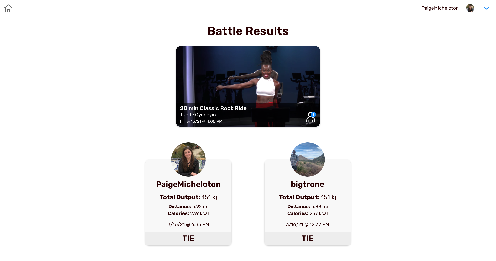

# Peloton Battle App

This is a React/Express App that authenticates you to the Peloton API using your Peloton login credentials (which are not stored). It utilizes the Peloton API to list the recent rides you have taken in common with the people that you follow on Peloton. You can select a ride and choose a friend to battle. Whoever has a higher output for that ride will be displayed as the winner of that battle.




## 💻 Development

To develop locally, please see the configuration section below.

Install dependencies in the root and `client` directories.
```
cd <app root>
npm install
cd client
npm install
```

To run the app:
```
cd <app root>
npm run dev
```

Open [http://localhost:3000](http://localhost:3000) to view it in the browser.

The page will reload if you make edits.

### 🛠 Configuration

You will need the following config file in place to run the app. There is a sample in `.env.example`.


Create a `.env` file, replacing `SESSION_SECRET` with your desired secret string (any random string).
```
SESSION_SECRET=<YOUR_DESIRED_SECRET>
SESSION_MAX_AGE=1800000
```
